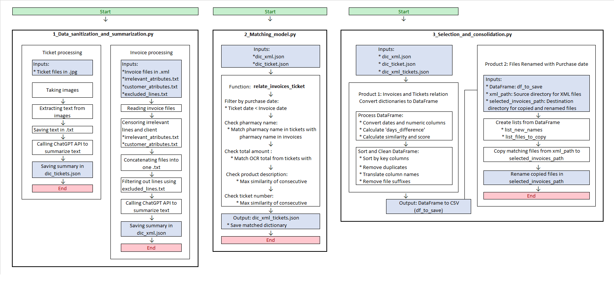

# Invoice - Ticket identifier

The photographs of tickets and their invoices in XML format are given. An accountant needs the XML files and the purchase date, but the date is only on the tickets, not in the XML files. This project aims to find the matching XML file for each ticket to infer the purchase date.

## Introduction

This project is designed to streamline the process of data analysis by providing a set of scripts and tools that facilitate data cleaning, processing, and visualization. The key features of this project include:

- **OCR and XML Handling**: Extract and process text from images and XML files for comprehensive analysis.
- **Automated Data Cleaning**: Customer information is cleaned to protect sensitive data, and unnecessary lines of text are deleted to reduce the number of tokens in queries made when calling OpenAI.
- **AI Integration**: Utilize OpenAI to analyze and summarize data effectively.
- **Data Similarity Evaluation**: Functions are developed to evaluate the similarity between fields. For example, the order of dates, digit-by-digit analysis of floating numbers, and substring similarity within strings.

By using this tool, you can save time and effort in preparing your data for analysis, ensuring that your insights are based on clean and well-processed data.

## Instructions

To get started with this project :

1. **Provide Input Files**: Ensure that your data files are available in the appropriate directories. The required files are:
   - `Tickets/*.jpeg`: The raw ticket images that need processing.
   - `xml_files/*.xml`: The raw XML files containing invoice information.
   - `excluded_lines.txt`: List of lines to exclude during XML processing.
   - `irrelevant_attributes.txt`: List of irrelevant attributes to ignore during XML processing.
   - `customer_attributes.txt`: List of customer-related attributes to ignore during XML processing.

2. **Run the Scripts**: Execute the scripts in the following order:

   ### 1. Preprocess Images
   Process the ticket images by converting them to grayscale, enhancing their contrast, and applying binarization. The processed images are saved in the `processed` folder.
